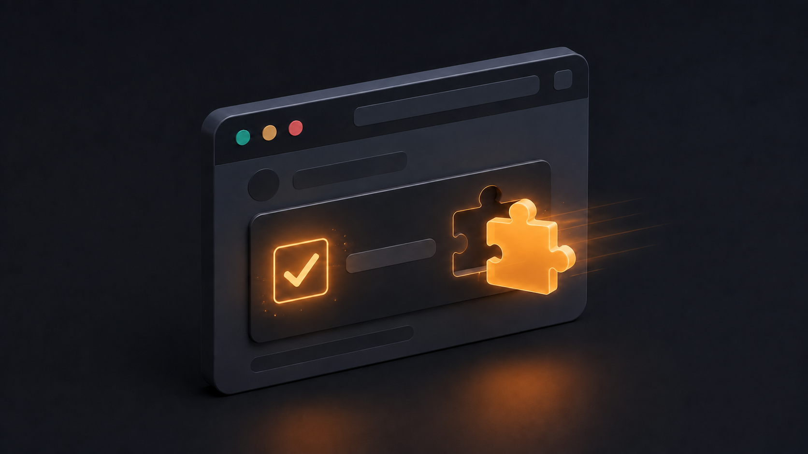

# Native CAPTCHA helpers



BetterWright handles simple, necessary CAPTCHA interactions inside the existing
browser session. It does not send sitekeys, tokens, screenshots, or API keys to
a third-party solving service.

> A CAPTCHA is a site asking automation to stop. Use these helpers only for a
> legitimate flow you are authorized to complete. Make one attempt, verify the
> result, and stop rather than repeatedly retrying a blocked site.

## Available helpers

Every `run()` snippet has a frozen `captcha` global:

| Helper | Purpose | Result |
| --- | --- | --- |
| `captcha.click(bounds)` | Click a checkbox-style widget | Fresh accessibility snapshot |
| `captcha.drag(from, to, {steps: 20})` | Smoothly drag a slider or puzzle handle | Fresh accessibility snapshot |
| `captcha.readText(bounds?)` | Capture only a text challenge for the agent's existing vision | `captcha` image artifact |

`bounds` uses CSS pixels: `{x, y, width, height}`. `from` and `to` use
`{x, y}`. The click helper targets the left side of the supplied widget bounds,
where checkbox challenges normally place their control.

## Checkbox challenge

```js
const frame = page.locator('iframe[title*="challenge" i], iframe[src*="captcha" i]').first();
const bounds = await frame.boundingBox();
if (!bounds) throw new Error('CAPTCHA widget is not visible');
return captcha.click(bounds);
```

The returned snapshot is captured after the click. The result envelope also
contains BetterWright's current `challenges` report. If the check did not clear,
do not loop the helper.

## Slider or puzzle drag

```js
const handle = page.locator('[role="slider"], .slider-handle').first();
const bounds = await handle.boundingBox();
if (!bounds) throw new Error('Slider handle is not visible');
const from = {x: bounds.x + bounds.width / 2, y: bounds.y + bounds.height / 2};
return captcha.drag(from, {x: from.x + 280, y: from.y}, {steps: 24});
```

## Text challenge

```js
const image = page.locator('img[src*="captcha" i], img[alt*="captcha" i]').first();
const bounds = await image.boundingBox();
if (!bounds) throw new Error('CAPTCHA image is not visible');
return captcha.readText(bounds);
```

This produces a tightly cropped PNG. Pi attaches that image directly to the
browser tool result, so its current vision-capable model reads it on the next
turn without a second model request. Other hosts can read the returned
`MEDIA:<path>` artifact and pass it to their existing vision input.

After reading the characters, type them with an ordinary Playwright action and
verify that the challenge disappeared:

```js
await page.locator('input[name*="captcha" i], input[id*="captcha" i]').fill(text);
await page.locator('button[type="submit"]').click();
return snapshot();
```

## Limits

These helpers reproduce normal mouse interaction and provide a token-efficient
vision crop. They do not manufacture reCAPTCHA, hCaptcha, or Turnstile tokens,
and they cannot guarantee that a provider will accept an automated browser. An
invisible, scored, multi-image, or still-blocked challenge should be reported to
the user rather than retried.
