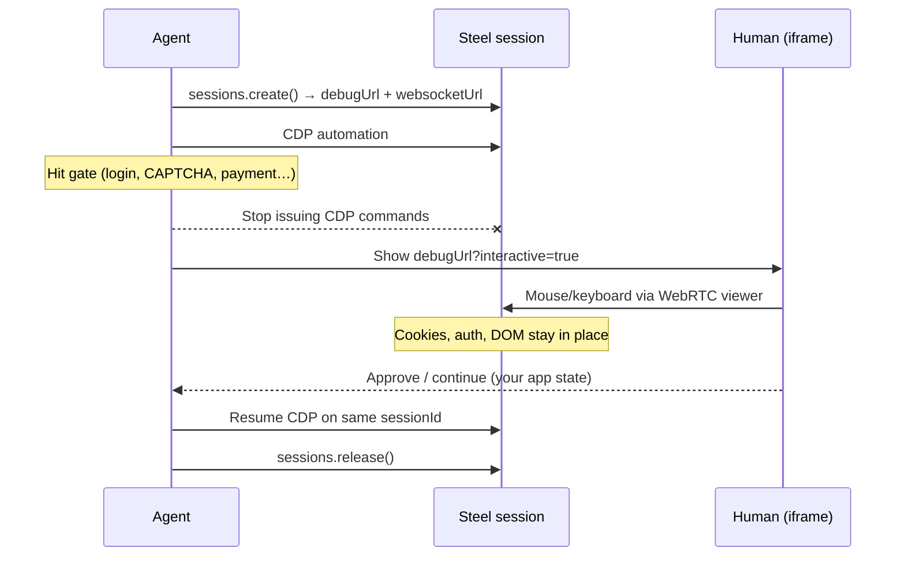

# Steel.dev browser handoff

**Research report · Jul 22, 2026**

How Steel transfers control between automation and humans on a live cloud browser session — mechanism, APIs, security, bandwidth, and what you must build yourself.

| | |
| --- | --- |
| Dedicated handoff API | **No** |
| Control surface | `debugUrl` |
| Live stream | WebRTC H.264 @ 25 fps |
| Typical viewer bandwidth | ~0.5–5 Mbps |

## Headline

Steel does not ship a “Handoff” endpoint. Operator takeover is **Human-in-the-Loop Controls**: keep one live session, stop your CDP driver, embed `session.debugUrl?interactive=true`, then resume automation on the same session ID. Pause / approve / ACL / audit are **application-owned**.

---

## 1. Terminology

Steel’s glossary and docs use several related terms. Only one of them is browser takeover.

| Term | What it means | Is this handoff? |
| --- | --- | --- |
| Human-in-the-Loop | Workflow pauses for a person to review, approve, or take over before the session continues | Yes — product name for this pattern |
| Session Viewer / `debugUrl` | Live URL that streams the running browser; can be interactive | Yes — the actual mechanism |
| Operator handoff (glossary) | WebRTC used for live viewing and operator handoff | Yes — informal synonym |
| OpenAI Agents SDK handoffs | Agent → agent routing in Steel cookbooks | **No** — orchestration, not browser control |

---

## 2. Architecture

One Steel session exposes **two concurrent control surfaces** against the same live browser state. Steel does not lock ownership between them.

### Automation channel

- **CDP over WebSocket**
- `session.websocketUrl` (+ API key)
- Playwright / Puppeteer drive clicks, navigation, extraction
- Authenticated

### Human channel

- **WebRTC video + remote input**
- `session.debugUrl`
- OS-level H.264 @ 25 fps
- Mouse / keyboard when `interactive=true`
- **Unauthenticated URL** (capability link)

### Recommended handoff sequence (app-owned)

1. Agent creates session → persist `id` + `debugUrl` + `websocketUrl`
2. Agent automates over CDP until a gated step
3. Agent **stops** issuing CDP commands (Steel does not auto-pause)
4. App creates an approval record (who / why / timestamps)
5. Authorized human opens interactive `debugUrl` embed
6. Human acts on real session state (cookies, DOM, auth stay)
7. Human approves / rejects via **your** UI — not via Steel
8. Agent resumes CDP on the same `sessionId`, or `release()`



---

## 3. API & embed surface

### Session create (relevant fields)

| Field | Role |
| --- | --- |
| `session.id` | Stable ID for resume, release, HLS replay |
| `session.debugUrl` | Live viewer / handoff link |
| `session.websocketUrl` | CDP attach for automation |
| `timeout` | Hard lifetime (ms). Default 5 min. Max ~24h by plan. Not editable live. |
| `inactivityTimeout` | Optional idle release. Resets on CDP commands **or** remote viewer input. |

### `debugUrl` query params

| Param | Default | Effect | Notes |
| --- | --- | --- | --- |
| `interactive` | `true` | Enable remote mouse/keyboard | `false` = watch-only |
| `showControls` | `true` (legacy) | URL bar + back/forward | Documented heavily for HITL; more complete on headless legacy |
| `theme` | `dark` | Viewer chrome theme | Headless / legacy only |
| `pageId` / `pageIndex` | — | Focus a specific tab | Headless / legacy only |

### Minimal interactive embed

```html
<iframe
  src={`${session.debugUrl}?interactive=true&showControls=true`}
  style="width: 100%; height: 600px; border: none;"
></iframe>
```

### Create with timeouts sized for HITL wait

```typescript
const session = await client.sessions.create({
  timeout: 600_000,           // 10 min hard cap
  inactivityTimeout: 120_000, // release after 2 min idle
});
// Human remote input resets inactivityTimeout
```

---

## 4. Streaming & bandwidth

Steel does not publish official Mbps figures. The stream is continuous **WebRTC H.264 video at 25 fps** while the viewer is open. Interactive input itself is negligible.

| What’s on screen | Typical viewer download |
| --- | --- |
| Mostly static UI / forms | ~0.5–2 Mbps |
| Scrolling, animations, busy pages | ~2–5 Mbps |
| Video playing in the page | can spike higher |

> Steel’s own note: “Headful video fidelity costs bandwidth. Budget for H.264 streaming in your observability plan instead of downscaling to screenshots.” — traces / debugging article

| Scenario | Bandwidth impact | Verdict |
| --- | --- | --- |
| Occasional HITL (login, CAPTCHA, approve) | Minutes of ~1–3 Mbps download to human | Fine on normal broadband |
| Always-on ops dashboard with many live embeds | N × continuous video streams | Gets expensive fast |
| Agent-only CDP, no `debugUrl` open | Tiny control traffic | Not a video cost |
| Post-run HLS/MP4 replay | On-demand download of recording | Separate from live handoff |

Bandwidth estimates are industry-typical for H.264 screen-share class streams (LiveKit / screen-share guides), not Steel-measured.

---

## 5. Security model

**Capability URL:** `debugUrl` is intentionally unauthenticated. Anyone with the link can view — and if interactive, control — the live session. Steel expects you to wrap embeds behind your own ACL or short-lived signed proxy.

| Risk | Mitigation |
| --- | --- |
| Link leakage (logs, Slack, tickets) | Proxy through your app; never paste raw `debugUrl` in public channels |
| Unauthorized takeover | Serve iframe only after reviewer auth; default `interactive=false` until confirmed |
| Lingering credentials after reject | Fail closed → `sessions.release()`; don’t leave Live sessions idle |
| Missing audit trail | Log `{ sessionId, approver, reason, timestamp, debugUrl params }` in your DB |
| HLS replay API key in browser | Proxy `/v1/sessions/{id}/hls` server-side; don’t ship `steel-api-key` to clients |

---

## 6. What Steel provides vs what you own

### Provided by Steel

- Live session with durable state
- `debugUrl` WebRTC viewer
- Interactive remote input
- CDP websocket for agents
- `timeout` / `inactivityTimeout`
- HLS/MP4 replay after release
- Agent traces timeline (separate product surface)

### Not provided (you own)

- Exclusive lock (agent vs human)
- Pause / resume API
- “Human finished” ack signal
- Approval queue / workflow engine
- Auth on `debugUrl`
- Audit log of who took control
- Live timeout extension mid-session

---

## 7. Session lifecycle constraints for HITL

| Constraint | Implication for handoff |
| --- | --- |
| Default lifetime 5 minutes | Approval queues longer than timeout blank the stream — raise `timeout` at create |
| Timeout not editable on live session | Size hard timeout for worst-case human wait upfront |
| `inactivityTimeout` resets on remote input | HITL-friendly: human activity keeps the session alive |
| Max ~24 hours by plan | Long-running supervised agents possible but still bill by minute |
| `release()` ends everything | On reject / timeout, release so credentials don’t linger |

---

## 8. Streaming history (why WebRTC matters)

As of Oct 2025, Steel made headful + WebRTC the default, replacing Chrome screencasting (4–12 fps, missed OS dialogs) and rrweb-based replays (DOM reconstruction drift). Live handoff and post-run evidence are now the same visual pipeline: OS-level capture → live WebRTC / durable MP4.

| Era | Live view | Replay | Handoff quality |
| --- | --- | --- | --- |
| Legacy | Chrome screencast 4–12 fps | rrweb event rebuild | Missed OS alerts / dialogs; unreliable |
| Current (default) | WebRTC H.264 @ 25 fps | MP4 / HLS 1:1 | Full OS surface; human can solve real dialogs |

---

## 9. Typical use cases

| Use case | Description |
| --- | --- |
| Sensitive input | User types passwords / OTP into the real session without handing secrets to the model |
| CAPTCHA / challenges | Human solves a challenge mid-flow; agent resumes with cookies intact |
| Approval gates | Stop before purchase / permission change; reviewer inspects or clicks through |
| Stuck-agent assist | Operator takes over a flaky step, then returns control to automation |

---

## 10. Confidence & open questions

| Claim | Confidence | Basis |
| --- | --- | --- |
| No dedicated handoff API; HITL via `debugUrl` | High | Official HITL + Live Sessions docs |
| WebRTC H.264 @ 25 fps headful default | High | Live Sessions docs + Oct 2025 blog |
| `debugUrl` unauthenticated by design | High | Repeated in docs and articles |
| App must own pause / ack / audit | High | HITL article: iframe is only control surface |
| Bandwidth ~0.5–5 Mbps typical | Medium | Industry H.264 screen-share norms; Steel publishes no Mbps |
| `showControls` on new headful embeds | Medium | HITL docs use it; Live Sessions headful table only lists `interactive` |
| Concurrent CDP + human input behavior | Medium | Shared state documented; no mutex docs — race possible if both drive |

---

## 11. Primary sources

- [Implement Human-in-the-Loop Controls](https://docs.steel.dev/overview/sessions-api/human-in-the-loop)
- [Live Sessions (`debugUrl`, interactive, WebRTC)](https://docs.steel.dev/overview/sessions-api/embed-sessions/live-sessions)
- [Session Lifecycle (timeout / inactivityTimeout / release)](https://docs.steel.dev/overview/sessions-api/session-lifecycle)
- [HITL article — approval as application state](https://llms.steel.dev/articles/human-in-the-loop-browser-agents/)
- [Headful Sessions blog (Oct 16, 2025)](https://steel.dev/blog/webrtc)
- [Traces / replay — bandwidth & security notes](https://llms.steel.dev/articles/browser-traces-replay-and-debugging/)
- [Glossary (HITL, debugUrl, WebRTC operator handoff)](https://llms.steel.dev/glossary/)

---

## Bottom line

Steel’s handoff is a **capability-link live viewer** on a persistent cloud browser — not a protocol with locks and handshakes.

For product design:

1. Treat `debugUrl?interactive=true` as the remote desktop surface
2. Size session timeouts for human wait
3. Gate the URL yourself
4. Stop CDP while a human is in control
5. Log approvals in your own system

Bandwidth is screen-share class (~Mbps per open viewer — fine for occasional takeover; costly if many always-on embeds).

---

*Researched Jul 22, 2026 from Steel official docs, blog, and glossary. Bandwidth figures are estimates pending Steel-published bitrates.*
